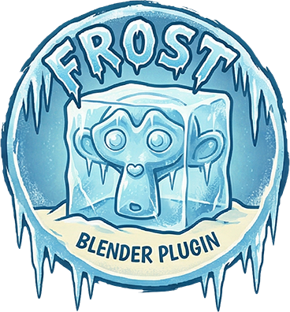
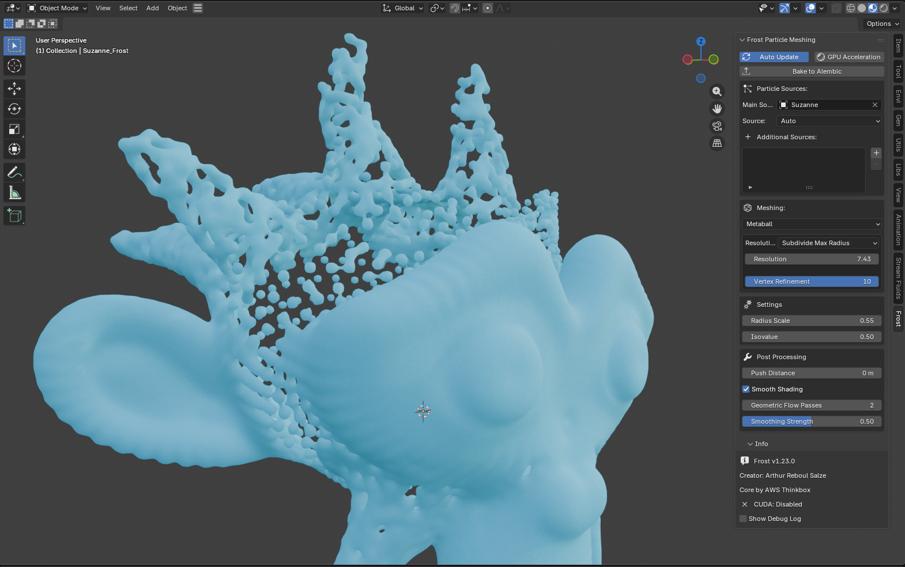

  

Frost for Blender is a Blender `5+` addon that turns particles, point clouds, and mesh vertices into polygonal surfaces using the Thinkbox Frost core, with an in-progress Vulkan GPU path in the same package.

Current release: `1.26.1`  

  

  Screenshot of the addon running inside Blender.

## What It Does

- Meshes Blender particle systems, Geometry Nodes point clouds, and mesh vertices
- Exposes multiple Frost meshing modes:
  - `Union of Spheres`
  - `Metaball`
  - `Zhu-Bridson`
  - `Anisotropic`
- Supports post-processing such as `Push Distance`, `Geometric Flow`, and `Smooth Shading`
- Supports animation workflows with `Auto Update` and `Bake to Alembic`

## Current State

- The CPU path is the stable reference path and remains the most feature-complete option.
- The Vulkan GPU path is already functional, but it is still a work in progress.
- Current testing indicates that CPU still usually wins on low-poly scenes, while Vulkan now reaches parity or can move ahead on heavier / high-poly scenes depending on the mesh, resolution, and animation state.
- The UI now shows the backend actually used for the last meshing pass, including when a requested GPU run fell back to the CPU for safety.
- The repository now also includes the first valid Blender Extensions manifest and local extension build setup for future submission work.

## Installation

1. Download the latest release zip from GitHub Releases.
2. In Blender `5+`, open `Edit > Preferences > Add-ons`.
3. Choose `Install from Disk...`.
4. Select the release zip.
5. Enable `Frost Particle Meshing`.

The current distribution model is a single package:

- CPU meshing included
- Vulkan GPU path included
- no separate user-facing CPU-only / GPU-only addon packages

## Important Notes

- `Vertex Refinement` still forces the final surface build back to the CPU path for now.
- `MESH` and `POINT_CLOUD` sources now use evaluated Blender geometry, so shape keys, armatures, Alembic caches, and animated point data are taken into account.
- The Vulkan path is still being optimized, and very dense animated scenes can still fluctuate more than the CPU path during playback.
- Restart Blender after replacing `frost_native.dll` or updating the addon files.

## Documentation

Documentation lives in [documentations/README.md](documentations/README.md).

Main files:

- [documentations/USER_GUIDE.md](documentations/USER_GUIDE.md)
- [documentations/TECHNICAL_REFERENCE.md](documentations/TECHNICAL_REFERENCE.md)
- [documentations/CHANGELOG.md](documentations/CHANGELOG.md)

## Project Layout

- `frost_blender_addon/`: Blender addon package and native runtime files
- `blender_frost_adapter/`: native bridge, CPU integration, CUDA code, and Vulkan backend
- `thinkbox-frost/`: Thinkbox Frost source integration
- `documentations/`: user and technical documentation

## Credits

- Arthur Reboul Salze
- AWS Thinkbox Frost core
- Codex
- Antigravity project generation / iteration workflow
